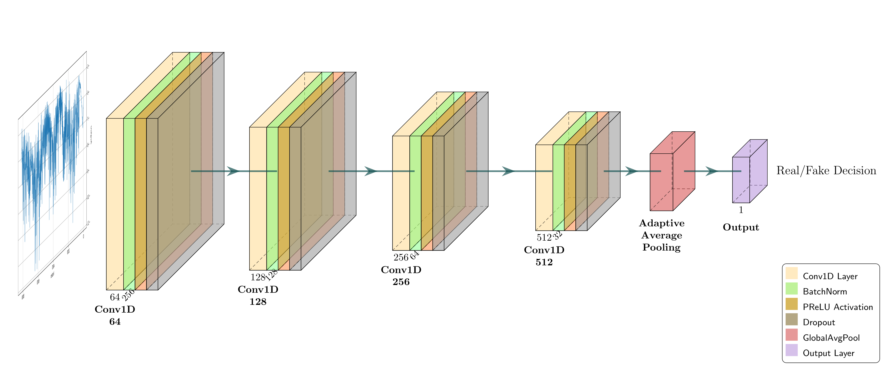
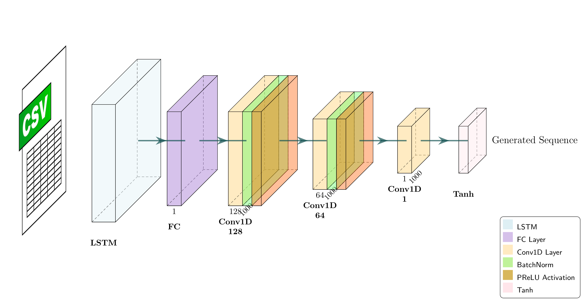
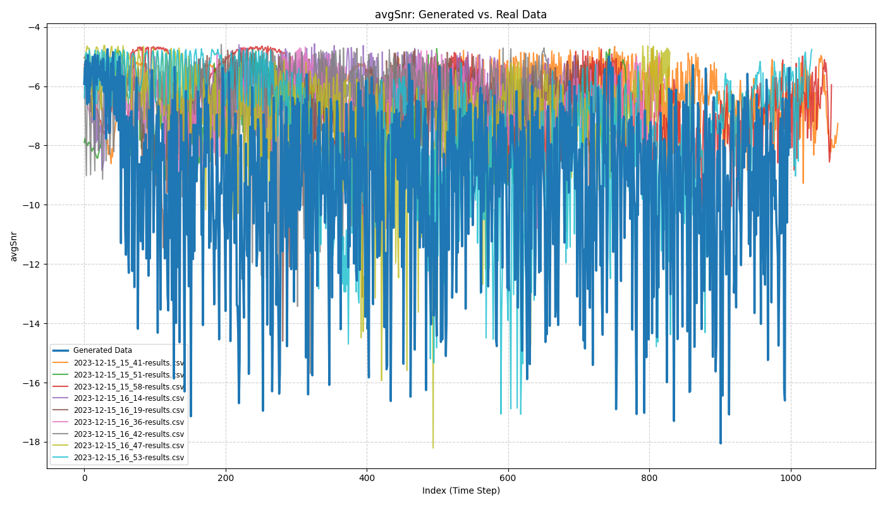
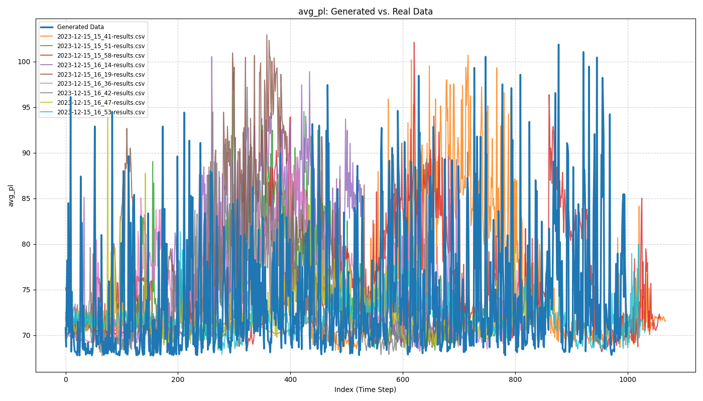
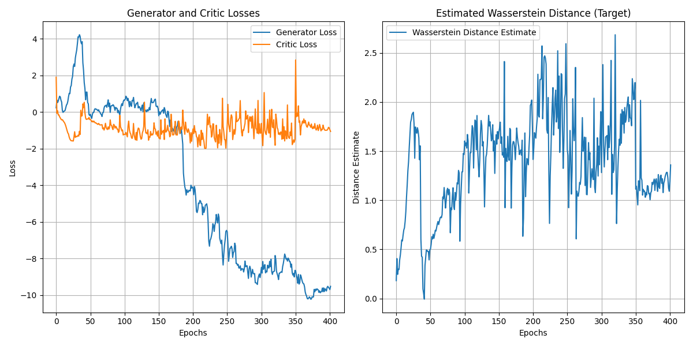

# Textual GAN for Wireless Channel Modeling

### Description:
(Needs to be completed)

### Model Architecture

**Discriminator (Critic):**  
The discriminator (critic) uses a Conv1D with four layers (64→128→256→512 channels) with batch normalization, PReLU activations, and dropout. Target features are processed through global average pooling before a final linear layer outputs a score. Unlike traditional discriminators, it omits sigmoid/tanh for Wasserstein-GAN compatibility.
<p align="center">
  
  <br><em>Fig: Discriminator model</em>
</p>

**Generator:**  
The generator processes a combined input of noise and flight condition features through an LSTM layer, followed by three Conv1D blocks (128→64→1 channels) with batch normalization and PReLU activations. Using kernel size 3 with padding, it preserves the 1000-step sequence length, while Tanh activation outputs normalized channel measurements (such as average path loss or SNR).
<p align="center">
  
  <br><em>Fig: Generator model</em>
</p>

### Example Results

#### Generated vs Real Channel Measurements
<p align="center">
  
  <br><em>Fig 1: Comparison of real vs generated SNR values</em>
</p>

<p align="center">
  
  <br><em>Fig 2: Comparison of real vs generated path loss values</em>
</p>

#### Training Metrics
<p align="center">
  
  <br><em>Fig 3: WGAN-GP conditional training loss progression</em>
</p>


### Usage:

> [!NOTE]  
> Running the model in a virtual environment is recommended!

```bash
python3 -m venv textgan
source textgan/bin/activate
pip install -r requirements.txt
```

1. Training the model:
   
```bash
python train.py
```

**Command Line Arguments:**

```console
josh@msu:/home/TextGAN-Channel-Modeling$ python train.py --help
usage: train.py [-h] [--lr LR] [--num_epochs NUM_EPOCHS]
                [--target {avg_pl,avgSnr}]

options:
  -h, --help               show this help message and exit
  --lr LR                  The learning rate to use for training (Default: 1e-4)
  --num_epochs NUM_EPOCHS  The number of epochs to train the model (Default: 402)
  --target {avg_pl,avgSnr} The feature that we want to generate (Default: 'avgSnr')
```

2. Inferencing the model:
   
To inference the trained model and generate a csv of output data, run:

```bash
python inference.py
```
